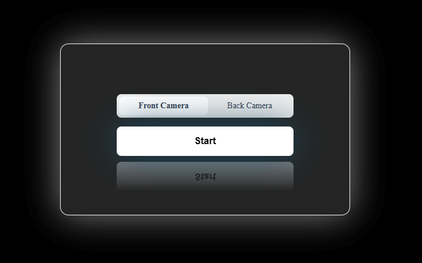

# Gesture Recognition App

This is a JavaScript application that uses a webcam to recognize hand gestures.



## Installation

Clone the repository and install dependencies.

```bash
$ git clone https://github.com/Hal51AI/GestureJS.git
$ cd GestureJS
$ npm install
```

## Usage

To start the application

```bash
$ npm run dev
```

# Instructions

### Screen Opacity

There is a screen opacity setting which you can change once the app has loaded the webcam. By default, the screen opacity is set to 90%. To change this, once the camera has loaded, drag the mouse across the screen horizontally to change the amount of opacity of the image.