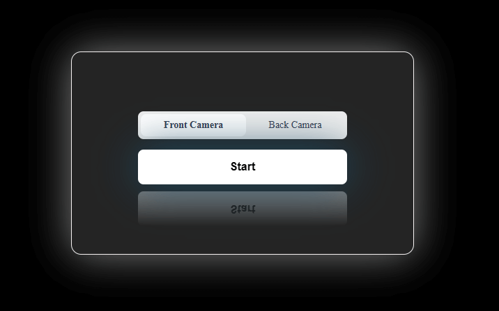

# Gesture Recognition App

This is a JavaScript application that uses a webcam to recognize hand gestures.



## Features

- **Real-time gesture recognition:** Processes live video from your webcam and displays recognized gestures.
- **Dynamic camera selection:** Choose between front and rear cameras when available.
- **Gesture overlay:** Visualizes detected hand landmarks and connections directly on the video.
- **Fullscreen mode:** Toggle fullscreen display of the output canvas for an immersive experience.
- **Adjustable screen opacity:** Change the overlay opacity by dragging the mouse or using touch events.

## Prerequisites

- [Node.js](https://nodejs.org/en/) (v12 or later)
- [npm](https://www.npmjs.com/)

## Installation

Clone the repository and install dependencies.

```bash
$ git clone https://github.com/Hal51AI/GestureJS.git
$ cd GestureJS
$ npm install
```

## Usage

### Start the Development Server

To run the application locally, use:

```bash
$ npm run dev
```

This command starts a development server (configured in webpack.config.js) and launches the application in your default browser.

# Instructions

## Controls
- __Start Camera__: Click the "Start" button to activate your webcam.
- __Camera Selection__: Choose between the front or back camera using the radio buttons in the UI.
- __Fullscreen Toggle__: Click the fullscreen icon to switch the output canvas to fullscreen mode. Click anywhere outside to exit fullscreen.
- __Opacity Control__: Adjust the overlay opacity by clicking and dragging horizontally on the screen.

## Screen Opacity

There is a screen opacity setting which you can change once the app has loaded the webcam. By default, the screen opacity is set to 90%. To change this, once the camera has loaded, drag the mouse across the screen horizontally to change the amount of opacity of the image.

# Troubleshooting
- __Webcam Access Issues__: Ensure your browser has permission to access your webcam.
- __Dependency Errors__: If npm install fails, verify that your Node.js and npm versions are current.
- __Development Server Errors__: Check your integrated terminal output in Visual Studio Code for error messages.

# License

This project is licensed under the MIT License. See the [LICENSE](./LICENSE) file for details.